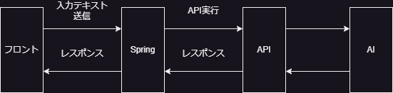
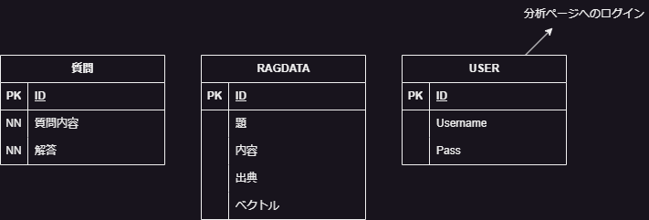
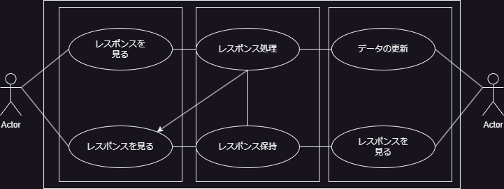

# 愛知県立愛知総合工科高等学校に関する質問回答に最適化したAIを用いたチャットアプリ

## 要件定義

### 愛知総合工科に興味のある中学生およびその保護者の要求要件
- アプリケーションの利用は手軽である必要がある。
- アプリケーションのレスポンスは早い必要がある。
- 一般的なチャットアプリケーションと似たようなUIを持つ必要がある。

### 学校側の要求要件

- 応答は常に正確である必要がある。
- データの更新は容易である必要がある。
- 保守コストが少ない必要がある。
- 質問内容を保存する必要がある。

## 使用技術

- Java
- Spring Framework(Maven)
- HTML/CSS/JavaScript
- Python
- Pytorch (BEAT)
- Flask or FastAPI

## システムの構成

- Web側はSpring(Java)をサーバーサイドとして、フロント側はHTML/CSS/JavaScriptを使いテンプレートはThymeleafとする。
- 入力されたテキストをUTF-8にエンコードし、API側にリクエストを送信し、AIのAPIにリクエストを送信する。

Python単体ではリクエストのタイムアウトが早すぎてお話にならないのでSpringをはさむ

### AIの調整

- RAG手法を用いて、AIに文書、ポスター等の知識をデータベース化したデータをもとに推論を行う。データのベクトル化は自作したプログラムを介し行う。
- 保存されるデータは題、内容、文書、年月日、ベクトル
- データの保存用のアプリケーションを用いてベクトル化する。
- STEM研究部、理工科と学習させていき、最終的には全体へと保存データを増やしていく。

## ER図

## ユースケース図

## クラス図
